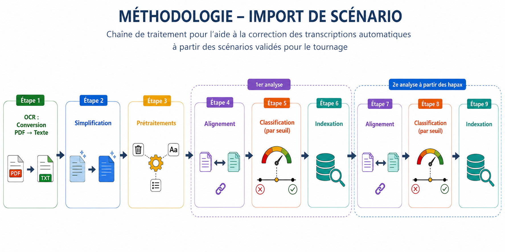

# Import de scénario

Les outils de transcriptions automatiques sont aujourd’hui largement utilisés dans de nombreux domaines pour convertir un contenu audio en texte, notamment dans le secteur de l’audiovisuel. Ces transcriptions constituent une ressource précieuse pour la création de sous-titres. A partir de la transcription d’un programme, les sous-titreurs peuvent en effet élaborer les sous-titres destinés à la diffusion. Malgré les progrès réalisés dans ce domaine, les systèmes de transcription automatique restent imparfaits et génèrent encore de nombreuses erreurs.

L’objectif est de fournir aux sous-titreurs une version préalablement corrigée, leur permettant de réduire le temps consacré aux tâches de relectures et de correction.

Corpus/données : scénarios validés et transcriptions automatiques correspondantes

------

Ceci est un extrait, et non l'entièreté du projet. 
